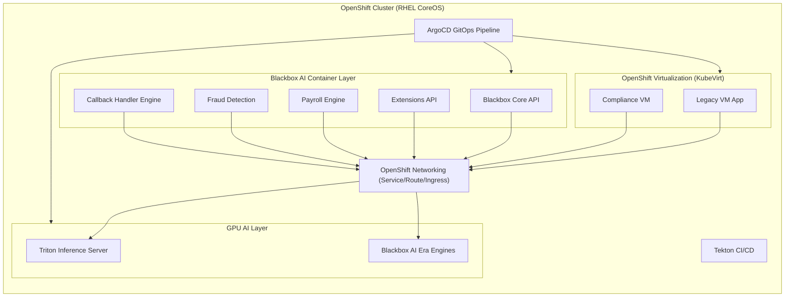

# Capetain Cetriva AI Hybrid Fund - System Topology

## Executive Summary

This document defines the complete topology and architecture of the Capetain
Cetriva AI Hybrid Fund system, integrating AI-driven market analysis, NVIDIA
GPU acceleration, banking operations, and financial allocation systems.

<!-- markdownlint-disable MD013 MD060 -->

---

## System Architecture

### Layer 1: Core Infrastructure

```text
┌─────────────────────────────────────────────────────────────────────────────┐
│                        CAPETAIN CETRIVA AI HYBRID FUND                      │
├─────────────────────────────────────────────────────────────────────────────┤
│                                                                             │
│  ┌─────────────────────────────────────────────────────────────────────┐   │
│  │                    NVIDIA BLACKWELL INTEGRATION                     │   │
│  │  ┌──────────────┐  ┌──────────────┐  ┌──────────────┐               │   │
│  │  │ GPU Monitor  │  │ CUDA 12.4+   │  │ Fleet Command │               │   │
│  │  │   (NVML)     │  │ Compatible   │  │    API        │               │   │
│  │  └──────────────┘  └──────────────┘  └──────────────┘               │   │
│  └─────────────────────────────────────────────────────────────────────┘   │
│                                                                             │
│  ┌───────────────┐  ┌───────────────┐  ┌───────────────┐  ┌──────────────┐   │
│  │   AI Models   │  │    Market    │  │    Trend     │  │   Quantum    │   │
│  │   Layer       │  │    Trend     │  │   Analysis    │  │   AI Engine  │   │
│  │               │  │  Analysis    │  │               │  │              │   │
│  │ • TrendPred   │  │              │  │ • GLD/NVDA   │  │ • Hybrid     │   │
│  │ • Neural Net  │  │              │  │ • RNN/LSTM   │  │ • Qiskit     │   │
│  │ • RL Agent    │  │              │  │ • Feature    │  │ • Simulation │   │
│  └───────────────┘  └───────────────┘  └───────────────┘  └──────────────┘   │
│                                                                             │
└─────────────────────────────────────────────────────────────────────────────┘
```

### Layer 2: Banking Operations

```text
┌─────────────────────────────────────────────────────────────────────────────┐
│                         BANKING OPERATIONS LAYER                            │
├─────────────────────────────────────────────────────────────────────────────┤
│                                                                             │
│  ┌──────────────────┐  ┌──────────────────┐  ┌──────────────────┐        │
│  │   Account        │  │   Routing        │  │   Validation     │        │
│  │   Generation     │  │   Number         │  │                  │        │
│  │                  │  │                  │  │                  │        │
│  │ • Luhn Checksum  │  │ • Cache System   │  │ • ABA Checksum   │        │
│  │ • Format Valid   │  │ • API Lookup     │  │ • Format Check   │        │
│  │ • 9-digit std    │  │ • 021000021      │  │ • Bank ID verify │        │
│  └──────────────────┘  └──────────────────┘  └──────────────────┘        │
│                                                                             │
│  ┌──────────────────┐  ┌──────────────────┐  ┌──────────────────┐        │
│  │   ACH Payments   │  │ Plaid Integration│  │   Financial      │        │
│  │                  │  │                  │  │   Management     │        │
│  │ • Create Payment │  │ • Link Token     │  │                  │        │
│  │ • Get Status     │  │ • Exchange Token  │  │ • Profit Alloc   │        │
│  │ • Mock Gateway   │  │ • Get Accounts    │  │ • AI Allocation  │        │
│  └──────────────────┘  └──────────────────┘  │ • Spend Profits  │        │
│                                               └──────────────────┘        │
│                                                                             │
│  ┌──────────────────────────────────────────────────────────────────────┐   │
│  │                    Capetain Private AI Bank                          │   │
│  │  Routing: 021000021  |  Charter: OCC Special Purpose  |  AUM: $150M  │   │
│  └──────────────────────────────────────────────────────────────────────┘   │
│                                                                             │
└─────────────────────────────────────────────────────────────────────────────┘
```

### Layer 3: Financial Allocation System

```text
┌─────────────────────────────────────────────────────────────────────────────┐
│                      FINANCIAL ALLOCATION SYSTEM                            │
├─────────────────────────────────────────────────────────────────────────────┤
│                                                                             │
│  Total Profit Pool → AI-Driven Allocation                                   │
│                                                                             │
│  ┌────────────────────────────────────────────────────────────────┐      │
│  │                    ALLOCATION DECISION ENGINE                  │      │
│  │  ┌─────────────────────────────────────────────────────────┐   │      │
│  │  │             AI Market Trend Analysis                    │   │      │
│  │  │  • NVDA/GLD sentiment analysis                          │   │      │
│  │  │  • Reinforcement learning                               │   │      │
│  │  │  • GPU-accelerated prediction                           │   │      │
│  │  │  • Dynamic allocation adjustment                        │   │      │
│  │  └─────────────────────────────────────────────────────────┘   │      │
│  │                              ↓                                  │      │
│  │  ┌─────────────────────────────────────────────────────────┐   │      │
│  │  │             ALLOCATION PERCENTAGES                      │   │      │
│  │  │   - Alternative Assets: 60%                             │   │      │
│  │  │   - Public Equities:    30%                             │   │      │
│  │  │   - Digital Assets:     10%                             │   │      │
│  │  └─────────────────────────────────────────────────────────┘   │      │
│  └────────────────────────────────────────────────────────────────┘      │
│                                    ↓                                      │
│  ┌────────────────────────────────────────────────────────────────┐      │
│  │                    SPENDING EXECUTION                          │      │
│  │  ┌───────────────┐  ┌───────────────┐  ┌───────────────┐      │      │
│  │  │ Alternative   │  │ Public        │  │ Digital       │      │      │
│  │  │ Assets        │  │ Equities      │  │ Assets        │      │      │
│  │  │ (60%)         │  │ (30%)         │  │ (10%)         │      │      │
│  │  │               │  │               │  │               │      │      │
│  │  │ • Private     │  │ • AI-Enhanced │  │ • Blockchain  │      │      │
│  │  │   Equity      │  │   Stock Sel   │  │ • Crypto      │      │      │
│  │  │ • Real Est    │  │ • NVDA/GOOGL  │  │ • DeFi        │      │      │
│  │  │ • Commod      │  │ • GPU Funds   │  │ • Tokens      │      │      │
│  │  └───────────────┘  └───────────────┘  └───────────────┘      │      │
│  └────────────────────────────────────────────────────────────────┘      │
│                                                                             │
└─────────────────────────────────────────────────────────────────────────────┘
```

---

## Financial Topology

### AUM Structure (Current)

| Division                | Amount ($) | Percentage | Description                                    |
| ----------------------- | ----------- | ---------- | ---------------------------------------------- |
| Investment Fund         | 75M         | 50%        | Private equity, public markets, digital assets |
| Banking Operations      | 30M         | 20%        | Loans, deposits, credit facilities             |
| Wealth Management       | 30M         | 20%        | High-net-worth portfolios, trusts              |
| Legal Protection (ESA)  | 15M         | 10%        | Litigation funding, asset protection           |
| **Total AUM**           | **$150M**   | **100%**   | Aggregate of all divisions                     |

### Investment Allocation

| Asset Class        | Allocation | Strategy                                 |
| ------------------ | ---------- | ---------------------------------------- |
| Alternative Assets | 60%        | Private Equity, Real Estate, Commodities  |
| Public Equities    | 30%        | AI-enhanced stock selection               |
| Digital Assets     | 10%        | Blockchain-based investments              |

### Sector Allocation (Investment Thesis)

| Sector                | Percentage | Focus                    |
| --------------------- | ---------- | ------------------------ |
| Technology Disruption | 35%        | AI, Quantum, Blockchain  |
| Real Assets           | 30%        | Real Estate, Commodities |
| Private Growth Equity | 25%        | Tech Healthcare, Fintech |
| Liquidity Reserve     | 10%        | Fixed Income, Cash       |

---

## Integration Flow

```text
┌─────────────────────────────────────────────────────────────────────────────┐
│                    NVIDIA BLACKWELL → AI → FINANCE PIPELINE                │
├─────────────────────────────────────────────────────────────────────────────┤
│                                                                             │
│  1. NVIDIA INIT                     2. MARKET ANALYSIS                     │
│  ┌────────────────────┐             ┌────────────────────┐                │
│  │ • GPU Detection    │────────────▶│ • Data Download    │                │
│  │ • CUDA 12.4+       │             │ • Feature Eng      │                │
│  │ • NVML Monitoring   │             │ • Model Training   │                │
│  │ • Blackwell Comp    │             │ • RL Training      │                │
│  └────────────────────┘             └────────────────────┘                │
│           │                                   │                            │
│           │                                   ↓                            │
│           │                         ┌────────────────────┐                │
│           │                         │ AI PREDICTION      │                │
│           │                         │ • Positive Trend    │                │
│           │                         │   → Full Alloc      │                │
│           │                         │ • Negative Trend    │                │
│           │                         │   → 50% Alloc       │                │
│           │                         └────────────────────┘                │
│           │                                   │                            │
│           └───────────────┬──────────────────┘                              │
│                          ↓                                                  │
│  3. FINANCIAL ALLOCATION                                                   │
│  ┌────────────────────────────────────────────────────────────────┐        │
│  │                     ALLOCATE_AND_SPEND_PROFITS                 │        │
│  │                                                                  │      │
│  │  Input: $10,000 (example)                                        │      │
│  │                                                                  │      │
│  │  Alternative Assets: $6,000 (60%)  ──▶ ACH Payment               │      │
│  │  Public Equities:    $3,000 (30%)  ──▶ AI-Enhanced ACH           │      │
│  │  Digital Assets:     $1,000 (10%)  ──▶ Blockchain ACH            │      │
│  │                                                                  │      │
│  └────────────────────────────────────────────────────────────────┘        │
│                          │                                                  │
│                          ↓                                                  │
│  4. SPENDING (Oscar Broome)                                                │
│  ┌────────────────────────────────────────────────────────────────┐        │
│  │                   SPEND_PROFITS_FOR_OSCAR                       │        │
│  │                                                                  │      │
│  │  • Destination: Oscar Broome's account                           │      │
│  │  • Routing: 021000021 (Capetain Private AI Bank)                 │      │
│  │  • Method: ACH Payment                                           │      │
│  │                                                                  │      │
│  └────────────────────────────────────────────────────────────────┘        │
│                                                                             │
└─────────────────────────────────────────────────────────────────────────────┘
```

---

## Module Dependencies

```text
┌─────────────────────────────────────────────────────────────────────────────┐
│                        MODULE DEPENDENCY GRAPH                               │
├─────────────────────────────────────────────────────────────────────────────┤
│                                                                             │
│  ┌─────────────────────────────────────────────────────────────────┐       │
│  │                    banking_utils.py (CORE)                      │       │
│  │                          ↓                                      │       │
│  │  ┌────────────┐ ┌────────────┐ ┌────────────┐ ┌───────────┐    │       │
│  │  │ generate_   │ │ get_routing│ │ validate_  │ │ ACHPay-   │    │       │
│  │  │ account     │ │ number     │ │ routing    │ │ ments.py  │    │       │
│  │  │ _number.py  │ │ .py        │ │ number.py  │ │           │    │       │
│  │  └────────────┘ └────────────┘ └────────────┘ └───────────┘    │       │
│  │         ↓           ↓            ↓            ↓                │       │
│  │  ┌──────────────────────────────────────────────────┐         │       │
│  │  │           plaid_integration.py                   │         │       │
│  │  └──────────────────────────────────────────────────┘         │       │
│  │         ↓                                                       │       │
│  │  ┌──────────────────────────────────────────────────┐         │       │
│  │  │         ai_models/market_trend_analysis.py       │         │       │
│  │  └──────────────────────────────────────────────────┘         │       │
│  │         ↓                                                       │       │
│  │  ┌──────────────────────────────────────────────────┐         │       │
│  │  │            nvidia_integration.py                 │         │       │
│  │  └──────────────────────────────────────────────────┘         │       │
│  └─────────────────────────────────────────────────────────────────┘       │
│                                                                             │
│  ┌─────────────────────────────────────────────────────────────────┐       │
│  │              e2e_nvidia_blackwell_integration.py                │       │
│  │                 (Orchestrates Full Pipeline)                    │       │
│  └─────────────────────────────────────────────────────────────────┘       │
│                                                                             │
└─────────────────────────────────────────────────────────────────────────────┘
```

---

## Key Files and Functions

### Core Banking Modules

| File                     | Function                     | Description                                      |
| ------------------------ | ---------------------------- | ------------------------------------------------ |
| `generate_account_number.py` | `generate_account_number()` | Generate valid account numbers with Luhn checksum |
| `get_routing_number.py`  | `get_routing_number()`       | Retrieve routing numbers with caching            |
| `validate_routing_number.py` | `validate_routing_number()` | Validate ABA routing numbers                     |
| `ach_payments.py`        | `create_payment()`          | Create ACH payments                              |
| `plaid_integration.py`   | `create_link_token()`       | Plaid API integration                            |

### AI/ML Modules

| File                                | Class/Function             | Description                            |
| ----------------------------------- | -------------------------- | -------------------------------------- |
| `nvidia_integration.py`             | `NVIDIAIntegration`        | GPU monitoring, Blackwell compatibility |
| `ai_models/market_trend_analysis.py` | `MarketTrendAnalysis`      | Market prediction with PyTorch         |
| `e2e_nvidia_blackwell_integration.py` | `E2ENVIDIAIntegration`     | Full E2E pipeline orchestration        |

### Unified Banking Interface

| File               | Class          | Methods                                                                 |
| ------------------ | -------------- | ---------------------------------------------------------------------- |
| `banking_utils.py`  | `BankingUtils` | `generate_account()`, `get_routing()`, `validate_routing()`, `create_ach_payment()`, `spend_profits_for_oscar()`, `allocate_and_spend_profits()` |

---

## Financial Updates Applied

1. **Profit Allocation System**: AI-driven allocation based on investment thesis
2. **Dynamic Adjustment**: 50% reduction in equities if negative market trend predicted
3. **Target AUM**: $500M by 2026 with defined growth strategy
4. **Fee Structure**: 2% management, 20% performance fees integrated
5. **Multi-tier AUM**: Investment Fund (50%), Banking (20%), Wealth (20%), ESA (10%)

---

## System Configuration

```python
# Configuration Constants
ROUTING_NUMBER = "021000021"  # Capetain Private AI Bank
ACCOUNT_LENGTH = 9  # Standard checking account
TRANSACTION_FEE = 0.00  # No fee for internal transfers

# Allocation Percentages
ALLOCATION_ALTERNATIVE = 0.60
ALLOCATION_EQUITIES = 0.30
ALLOCATION_DIGITAL = 0.10

# AUM Configuration
AUM_INVESTMENT_FUND = 75_000_000
AUM_BANKING = 30_000_000
AUM_WEALTH = 30_000_000
AUM_ESA = 15_000_000
AUM_TOTAL = 150_000_000
```

---

## OpenShift Deployment Topology

The financial application runs on an OpenShift cluster in two modes — a legacy
KubeVirt virtual machine and a modernized container deployment — managed via
ArgoCD GitOps.



### Deployment Manifests

| Manifest | Description |
| ----------------------------------------------- | ---------------------------------------------------- |
| `docs/manifests/legacy-financial-app-vm.yaml` | Legacy app as a KubeVirt `VirtualMachine` |
| `docs/manifests/financial-app-modern-deployment.yaml` | Modernized app as a container `Deployment` |
| `docs/manifests/blackbox-modernization-argocd-app.yaml` | ArgoCD `Application` for GitOps sync |

Switch the deployment target between VM and container mode by changing the
`appMode` label (`vm` or `"container"`).

---

*This topology document was created as part of the Capetain Cetriva AI Hybrid Fund system architecture.*
